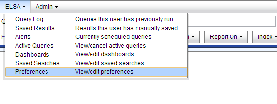
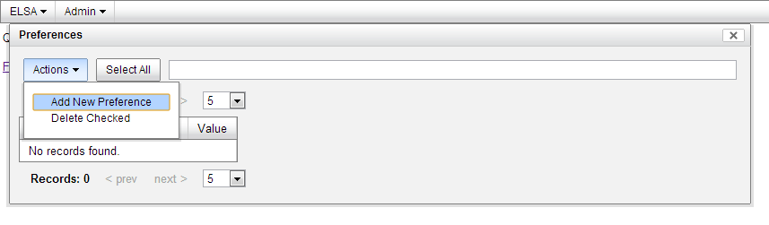

# CapME Authentication #
Our Setup script automatically configures both Snorby and ELSA to be able to pivot to CapME for full transcripts.  The CapME page will prompt you for username/password and you will enter your normal Sguil/Squert/ELSA username/password.  You have the option of automatically authenticating, but be aware that this will send your username/password in the GET request, so it will be displayed in the browser bar in plaintext.

## Configuring Snorby to auto-authenticate to CapME ##
  * Click "Administration and General Settings".
  * Under OpenFPC, select "Packet capture auto-authenticate" and enter your **Sguil** username and password.
  * Click "Save Settings".

## Configuring ELSA to auto-authenticate to CapME ##
  * Navigate to ELSA -> Preferences: 
 
 
  * Select Actions -> Add New Preference: 
 
 
  * Enter the following into the new Preference: 
<pre><code>Type = custom 
Name = openfpc_username 
Value = "your **Sguil** username" 
</code></pre>
  * Enter the following into the new Preference: 
<pre><code>Type = custom 
Name = openfpc_password 
Value = "your **Sguil** password" 
</code></pre>
  * Close the Preferences window and reload the ELSA page (F5).