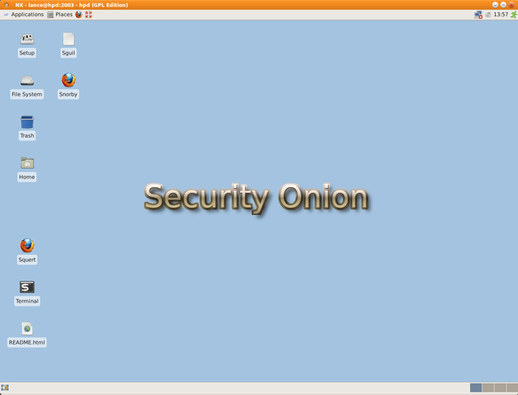
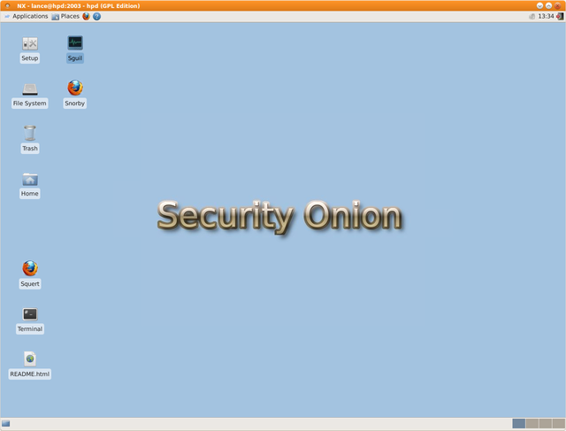
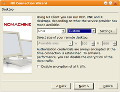
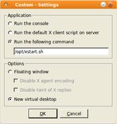

#### Overview ####

**Note from Doug Burks: We don't really recommend or support FreeNX, but some folks like to use it, so here are the notes from Lance Honer.  If you choose to install FreeNX, you should harden your server and [tighten its UFW firewall](Firewall).**

**Also see the Ubuntu page on FreeNX (especially the section entitled "Using custom SSH keys"):
https://help.ubuntu.com/community/FreeNX**

Author:  Lance Honer

Here's a quick writeup for how to get FreeNX installed and playing nicely with Sguil on your Security Onion installation. Check out the [Wikipedia page on NX Technology](http://en.wikipedia.org/wiki/NX_technology) for some background information but in a nutshell FreeNX is remote desktop for Linux and near local console speeds over network connections of any speed. This type of access is very useful when working with Security Onion since you may want to use tools included on the Security Onion distribution to analyze the data captured by the IDS sensors but not have local access to the server e.g. working at your desktop while the server is in the data center.

#### Post Installation Issues ####

  1. There are two issues that occur after installation, first is that due to a dependency between FreeNX and tk8.4 the Sguil client will fail to start. If you were to execute the Sguil client from the command line after installing FreeNX you'll receive the following error:
```
  ERROR: Cannot fine the Iwidgets extension.
  The iwidgets package is part of the incr tcl extension and is
  available as a port/package most systems.
  See http://www.tcltk.com/iwidgets/ for more info.
```
  1. The second is once FreeNX is installed and you open a remote session to the server you'll notice the icons and user interface look different from logging in at the console. What you'll see are the standard XFCE icons rather than the Xubuntu ones.
](images/freenx/XFCE.png)

](images/freenx/Xubuntu.png)

#### FreeNX Server installation and fix for the first issue ####

After you follow Doug's instructions for installing and configuring Security Onion you can install the FreeNX Server in a few easy steps. They are taken from the [Ubuntu Community Documentation for FreeNX](https://help.ubuntu.com/community/FreeNX). Typically I do this process from my desktop over SSH as it makes distributing the key easier.

  1. SSH into your Security Onion server
  1. Add the FreeNX PPA
```
sudo add-apt-repository ppa:freenx-team
```
  1. Update
```
sudo apt-get update
```
  1. Install
```
sudo apt-get install freenx
```
  1. Download the setup script
```
wget https://bugs.launchpad.net/freenx-server/+bug/576359/+attachment/1378450/+files/nxsetup.tar.gz
```
  1. Extract
```
tar -xvf nxsetup.tar.gz
```
  1. Copy the setup script to the correction location
```
sudo cp nxsetup /usr/lib/nx/nxsetup
```
  1. Run setup
```
sudo /usr/lib/nx/nxsetup --install
```
  1. During setup indicate you wish to create new RSA keys by typing 'Y' at the prompt and continuing
  1. After setup is complete you will need to grab a copy of the new RSA private key. This will be needed when configuring the server connection on your desktop machine. It is located at /var/lib/nxserver/home/.ssh/client.id\_dsa.key. I'll usually cat it out to the terminal window as it will be needed in the next step.

Now that the FreeNX Server is up and running if you were to attempt to launch Sguil from the desktop link you'll notice that nothing happens. This is due to a symlink change made during the installation that affects the execution of the 'wish' command. Execution of 'wish' launches /usr/bin/wish which is a symlink to /etc/alternatives/wish. Prior to the FreeNX Server installation the symlink /etc/alternatives/wish pointed to /usr/bin/wish8.5 and now points to a newly created symlink /usr/bin/wish-default which points to /usr/bin/wish8.4. You need to change it back so that exection of 'wish', by Sguil, will launch tk8.5 and not tk8.4.

```
sudo ln -sf /usr/bin/wish8.5 /etc/alternatives/wish
```

#### FreeNX Client installation and fix for the second issue ####
At this point the Security Onion server is ready to go with FreeNX but your desktop will need the client. There are a few different clients but I always use the official NoMachine client. If you bothered to read the Wikipedia article mentioned above you'll know that NoMachine developed the NX Technology and FreeNX is the open source version of it. NoMachine provides free versions of the NX client for Windows, Linux, OSX and Solaris. See http://www.nomachine.com/select-package-client.php for the appropriate client. After installing the client you'll have a menu entry somewhere on your system, i.e. Applications -> Internet in Ubuntu, Start -> Programs in Windows, etc. Launch the NX Connection Wizard and follow the steps below:

  1. Click Next on the intro page
  1. Provide a name for the session and the DNS name or IP address in the Host field. If you have changed the port SSH listener port on your Security Onion installation then modify the port field accordingly and click Next.
  1. On the Desktop wizard screen change the KDE entry to Custom and click the Settings button.
](images/freenx/NXClient01.png)
  1. On the Custom - Settings screen modify as shown in the picture below (we will create the /opt/xstart.sh script below) and click Next.
](images/freenx/NXClient02.png)
  1. On the Configuration completed screen check the box for Show the Advanced Configuration dialog and click Finish.
  1. Here is where you will provide the custom RSA key that was generated during the server install. Click the Key… button, delete the existing key data and paste in your custom key (from step 10 above). Click Save and then OK.
  1. You'll now be at a NoMachine login dialog.
  1. Now we need to head back over to the FreeNX server to create the /opt/xstart.sh script referenced in step 4. This will fix the second issue mentioned at the beginning of this blog post regarding the XFCE v.s Xubuntu UI icons. NOTE: Step 10 in the FreeNX Server install left you sitting at a $ prompt in your home directory on the FreeNX server.
  1. Create the following script that will set up all of the correct environment variables and execute the proper environment when you log in with the NXClient. Use your favorite editor or echo them into a file.

Security Onion 10.04 (you shouldn't be using this anymore):
```
    #!/bin/sh
    export XDG_CONFIG_DIRS='/etc/xdg/xdg-xubuntu:/etc/xdg'
    exec /usr/share/xubuntu/session.sh
```

Security Onion 12.04:
```
    #!/bin/sh
    export XDG_CONFIG_DIRS='/etc/xdg/xdg-xubuntu:/etc/xdg'
    exec startxfce4
```

  1. Give it execute permissions
```
chmod +x ./xstart.sh
```
  1. Move it to the /opt directory so that other remote users can use it
```
sudo mv ./xstart.sh /opt/xstart.sh
```
  1. Change ownership information
```
sudo chown root:root /opt/xstart.sh
```
  1. Now you can move back to the open NoMachine login window, provide your Security Onion username and password in the dialog boxes and click the Login button. If all goes well the client will connect to the server and you'll have a full desktop session to the Security Onion server.
  1. Lauch the Sguil icon on the desktop and if our fix from the first part of this tutorial was successfully the Sguil client should launch.
](images/freenx/Done.png)
